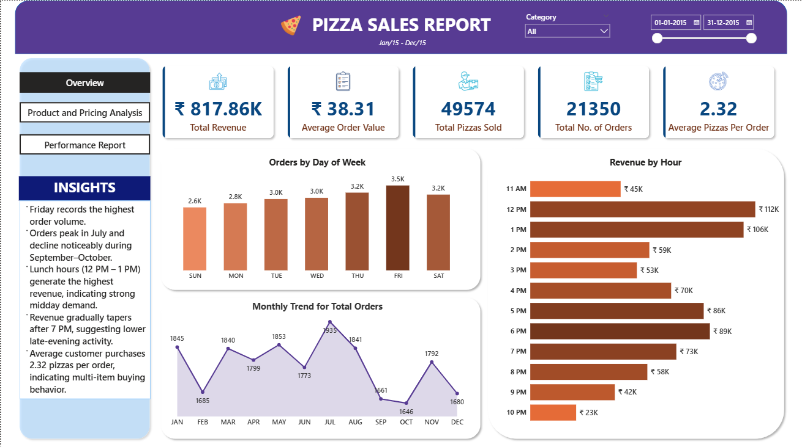

# 🍕 Pizza Sales Analysis

An end-to-end Data Analytics project that analyzes pizza sales data using SQL and Power BI to uncover revenue trends, customer ordering patterns, and product performance insights.

**Project Type:** Data Analysis / Business Intelligence  
**Dataset:** Pizza Sales Dataset  
**Tools:** SQL, Power BI  
**Key Focus:** Revenue analysis, sales trends, product performance, customer behavior

---

## Dashboard Preview

---

## Project Overview

This project analyzes pizza sales data to understand revenue performance, customer ordering behavior, and product popularity. SQL was used to compute key performance indicators and perform business analysis, while Power BI was used to build an interactive dashboard for visualization and insights.

---

## Objective

The objective of this project is to analyze pizza sales data and identify trends in revenue generation, order patterns, and product performance. By performing SQL analysis and visualizing the results in Power BI, the project aims to uncover insights that can support business decision-making.

---

## Dataset

The dataset contains transactional pizza sales records including the following fields:

- Order ID  
- Order Date  
- Order Time  
- Pizza Name  
- Pizza Category  
- Pizza Size  
- Quantity  
- Total Price  

These fields were used to calculate revenue metrics, analyze customer ordering behavior, and evaluate product performance.

---

## Key Performance Indicators (KPIs)

The following KPIs were calculated using SQL:

- **Total Revenue**
- **Average Order Value**
- **Total Pizzas Sold**
- **Total Orders**
- **Average Pizzas Per Order**

---

## SQL Business Analysis

SQL queries were used to answer several important business questions:

### Sales Trends
- Daily trend for total orders
- Monthly trend for total orders
- Revenue by hour to identify busiest times

### Product Analysis
- Percentage of sales by pizza category
- Percentage of sales by pizza size
- Total pizzas sold by category
- Average price per pizza by category

### Performance Analysis
- Top 5 pizzas by revenue
- Bottom 5 pizzas by revenue
- Top 5 pizzas by quantity sold
- Bottom 5 pizzas by quantity sold
- Top 5 pizzas by total orders
- Bottom 5 pizzas by total orders

---

## Additional SQL Analysis

Additional SQL analysis was performed to explore deeper insights:

- Revenue by hour (busiest time of the day)
- Average order value by month
- Weekend vs weekday revenue comparison
- Revenue concentration (Pareto analysis of top pizzas)

---

## Key Insights

- Lunch hours generate the highest revenue, indicating strong midday demand.
- Friday records the highest order volume across the week.
- Large-sized pizzas dominate overall sales, showing customer preference for larger portions.
- Classic pizza category drives the highest sales volume.
- A small number of top-performing pizzas contribute a significant portion of total revenue.

---

## Skills Demonstrated

- SQL Data Analysis  
- KPI Calculation  
- Business Performance Analysis  
- Data Visualization  
- Power BI Dashboard Development  
- Data Storytelling